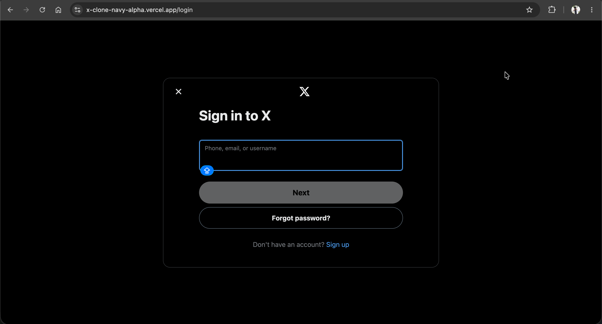
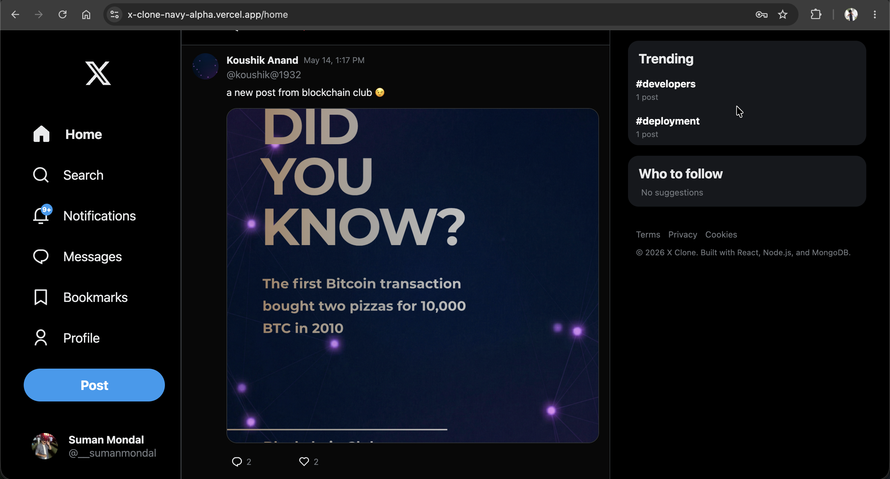
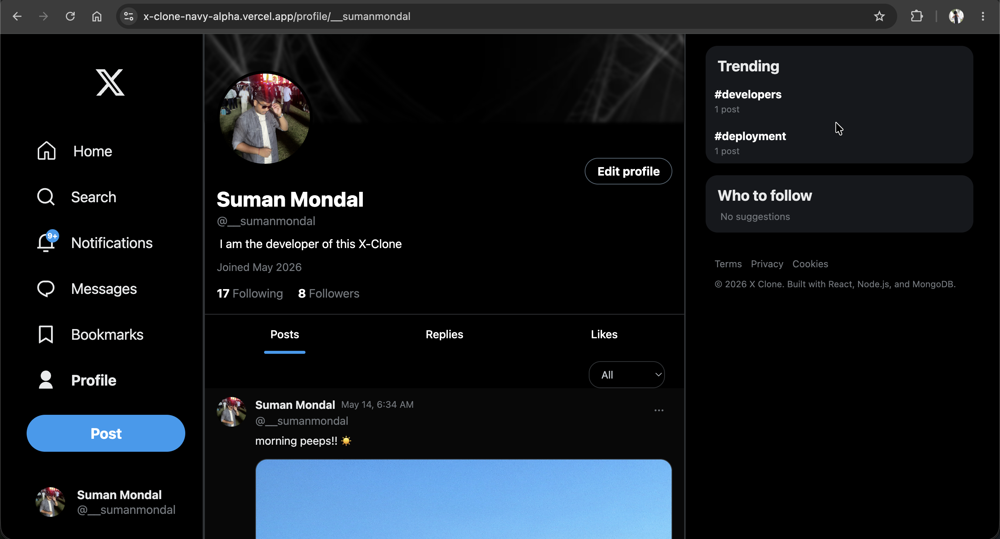
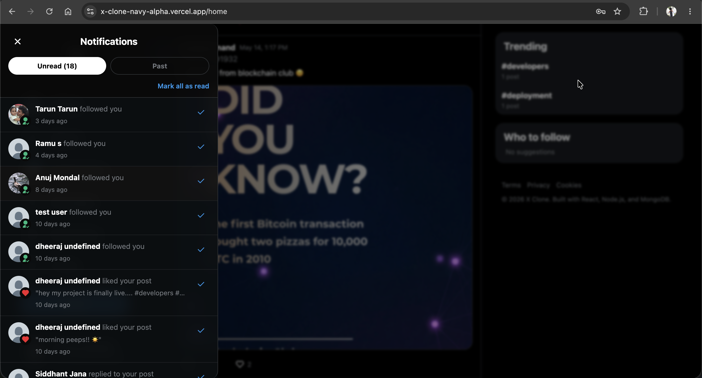
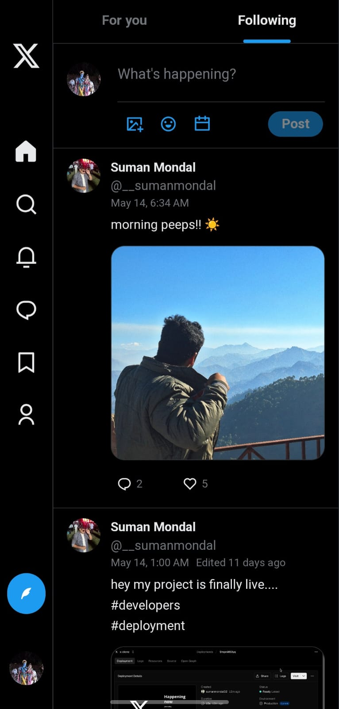
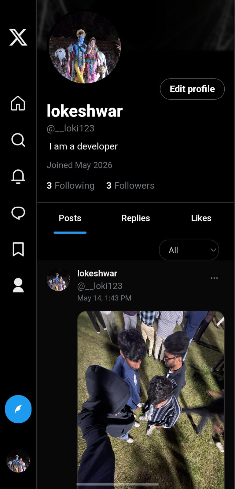
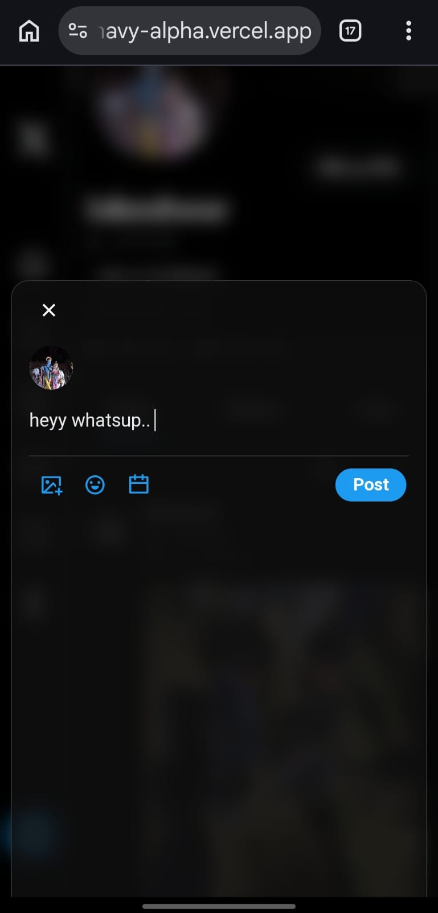

# Twitter/X Clone

A full-stack social media platform replicating core Twitter functionality with modern web technologies.

## 🖼️ Screenshots

### Web Version
<p align="center">
  
  
  
  
  
</p>

### Mobile Version
<p align="center">
  
  
  
</p>

## ⚡ Tech Stack

**Backend**
- Node.js + Express
- MongoDB + Mongoose
- JWT Authentication
- Cloudinary (media storage)
- Multer (file handling)

**Frontend**
- React + Vite
- Tailwind CSS
- Zustand (state management)
- React Router v6

## ✨ Features

### User Features
- Authentication (register, login, password reset via email)
- Profile management with image uploads
- Create, edit, schedule, and archive posts
- Like, comment, and engage with posts
- Follow/unfollow system with suggestions
- Real-time search with debouncing
- Trending hashtags and hashtag-based feeds
- Notifications (likes, comments, follows)
- Infinite scroll pagination
- Image lightbox viewer
- Account deactivation/reactivation

### Admin Features
- User management (block/unblock)
- Post moderation (hard delete)
- Dashboard with statistics
- Full visibility over all content

## 🏗️ Architecture Highlights

- **Denormalized counts** for optimized reads (follower/following/like counts)
- **Soft delete** pattern for posts with recovery option
- **Embedded documents** for likes/comments with separate notification collection
- **Scheduled posts** via node-cron background jobs
- **JWT refresh** on every auth check
- **Cloudinary cleanup** on failed uploads
- **Global error handling** for all known error types
- **CORS whitelist** with environment-based origins

## 📁 Project Structure

```
├── backend/
│   ├── APIs/
│   ├── models/
│   ├── config/
│   ├── middlewares/
│   └── server.js
└── frontend/
    ├── src/
    │   ├── components/
    │   ├── pages/
    │   ├── stores/
    │   ├── lib/
    │   └── styles/
    └── public/
```

## 🚀 Getting Started

### Prerequisites
- Node.js 16+
- MongoDB Atlas account
- Cloudinary account

### Installation

1. Clone the repository
```bash
git clone https://github.com/sumanmondal02/twitter-clone_mernstack.git
cd twitter-clone
```

2. Install backend dependencies
```bash
cd backend
npm install
```

3. Install frontend dependencies
```bash
cd ../frontend
npm install
```

4. Configure environment variables

**Backend** (`backend/.env`):
```env
PORT = 6435
DB_URL = your_mongodb_url
SECRET_KEY = your_jwt_secret
CLOUDINARY_CLOUD_NAME = your_cloud_name
CLOUDINARY_API_KEY = your_api_key
CLOUDINARY_API_SECRET = your_api_secret
NODE_ENV = development
FRONTEND_URL = http://localhost:5173
EMAIL_USER = your_email
EMAIL_PASS = your_email_password
```

**Frontend** (`frontend/.env`):
```env
VITE_URL = http://localhost:6435
```

5. Run the application

Backend:
```bash
cd backend
npm run dev
```

Frontend:
```bash
cd frontend
npm run dev
```

## 🎯 Key Implementation Details

- **Authentication**: JWT tokens stored in httpOnly cookies, verified on every request
- **File Uploads**: Multer memory storage → Cloudinary upload → cleanup on failure
- **Notifications**: Auto-created on likes/comments/follows, auto-deleted on undo actions
- **Pagination**: Cursor-based with infinite scroll on frontend
- **Search**: Debounced input with dynamic results (excludes admins)
- **Trending**: Hashtag extraction from post descriptions via regex, top 5 by frequency

## 📝 API Endpoints

| Route | Methods | Description |
|-------|---------|-------------|
| `/auth` | POST, GET, PUT | Authentication & password management |
| `/user-api` | GET, PUT, POST, DELETE | User profiles & relationships |
| `/post-api` | GET, POST, PATCH, DELETE | Posts, likes, comments |
| `/admin-api` | GET, PATCH, DELETE | Admin moderation |
| `/notification-api` | GET, PATCH, DELETE | Notifications |

## 🔐 Security Features

- Password hashing with bcrypt
- JWT token validation on protected routes
- Blocked/deactivated user checks on every request
- Password reset token versioning (invalidates old links)
- File type validation (JPG/PNG only, 15MB limit)
- CORS origin whitelist

## 🛠️ Future Improvements

- Real-time chat (WebSocket/Socket.io)
- Video upload support
- Repost functionality
- Bookmarks
- Email verification
- Private accounts
- Refresh token mechanism

## 🙌 Acknowledgements

Inspired by X / Twitter UI and functionality.

---

**Note**: This is a learning project built to understand full-stack development patterns and is not intended for production use.